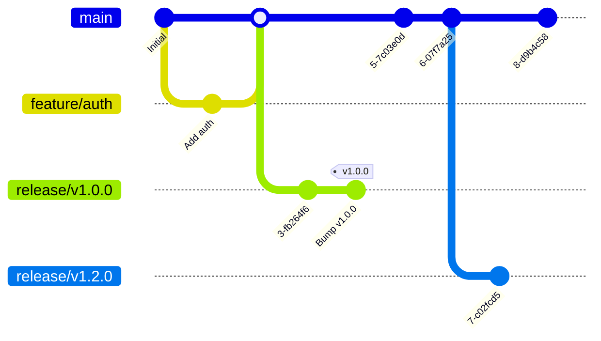

# Learn Testing

> **A comprehensive multi-language testing laboratory showcasing modern automated testing practices across different technology stacks.**

**Learn Testing** is your gateway to mastering automated testing across multiple languages and frameworks. Whether you're a QA engineer, developer, or DevOps enthusiast, this repository provides hands-on examples and best practices for building robust test automation suites.

## Quick Start

Choose your preferred development environment:

## Development Environment Setup

**Prerequisites:**

- [Visual Studio Code](https://code.visualstudio.com/)
- [Node.js](https://nodejs.org/en/download/) (version 22+)

**Setup:**

1. Install all prerequisites listed above
2. Run the setup script: `./script/setup`
3. Install recommended VS Code extensions: `Ctrl/Cmd + Shift + P` → `Extensions: Show Recommended Extensions`

### Option 2: Dev Containers

**Prerequisites:**

- [Visual Studio Code](https://code.visualstudio.com/)
- Container runtime:
  - **macOS:** [OrbStack](https://orbstack.dev/) (recommended)
  - **Other platforms:** [Docker Desktop](https://www.docker.com/products/docker-desktop)
- [Dev Containers extension](https://marketplace.visualstudio.com/items?itemName=ms-vscode-remote.remote-containers)

**Setup:**

1. Install prerequisites
2. Open VS Code in the project folder
3. Run command: `Dev Containers: Reopen in Container`

### Option 3: GitHub Codespaces

**Prerequisites:**

- [Visual Studio Code](https://code.visualstudio.com/)
- [GitHub Codespaces extension](https://marketplace.visualstudio.com/items?itemName=GitHub.codespaces)

**Setup:**

1. Install the GitHub Codespaces extension
2. Create a new codespace from the repository
3. The environment will be automatically configured

Or just click the button below to open in Codespaces:

[](https://github.com/codespaces/new?hide_repo_select=true&ref=main&repo=learn-testing)

## What You'll Learn

This repository demonstrates real-world testing scenarios across multiple dimensions:

### Testing Levels

- **Unit Testing**: Fast, isolated component tests
- **Integration Testing**: API and service integration validation
- **End-to-End Testing**: Complete user journey automation
- **Acceptance Testing**: Business requirement validation using BDD

### Technology Stack (Main Branch)

| Component        | Technology                            | Purpose                               |
| ---------------- | ------------------------------------- | ------------------------------------- |
| **Runtime**      | TypeScript + Node.js                  | Modern JavaScript development         |
| **Unit Tests**   | [Vitest](https://vitest.dev/)         | Fast unit testing with coverage       |
| **E2E Tests**    | [Playwright](https://playwright.dev/) | Cross-browser automation              |
| **BDD Tests**    | [Gauge](https://gauge.org/)           | Business-readable test specifications |
| **API Server**   | Express.js                            | Simple test target application        |
| **Code Quality** | SonarQube                             | Static analysis and quality gates     |
| **CI/CD**        | GitHub Actions + CircleCI             | Dual pipeline examples                |

### Project Structure

```
learn-testing/
├── server/           # Simple HTTP server for testing
├── tests/            # Unit and integration tests
├── specs/            # Gauge BDD specifications
├── coverage/         # Test coverage reports
├── script/           # Automation scripts
├── compose.yml       # Local SonarQube setup
└── config files      # Tool configurations
```

## Running Tests

### Development Workflow

```bash
# Run all unit tests with coverage
./script/test-dev
```

### Quality Assurance

```bash
# Set up QA environment
./script/setup-qa

# Start the test server
npm run start

# Run complete test suite
./script/test-qa
```

### Local SonarQube Setup

```bash
# Start local SonarQube server
docker-compose up -d

# Set environment variables
export SONAR_HOST_URL="http://localhost:9000"
export SONAR_TOKEN="your-token-here"

# Run analysis
./script/sonarscan
```

## CI/CD & DevOps

This project showcases enterprise-grade CI/CD practices with dual pipeline implementations. Each pipeline is designed to demonstrate different deployment strategies and environments with 3 separate environments: UAT, SIT, and Production.

### Deployment Pipelines

| Platform           | Deployment Target             | Container Registry |
| ------------------ | ----------------------------- | ------------------ |
| **GitHub Actions** | [Render](https://render.com/) | GitHub Packages    |
| **CircleCI**       | [Heroku](https://heroku.com/) | Docker Hub         |

### Environment Configuration

- GitHub Actions Secrets & Variables

  | Name                 | Type     | Environment | Description                      |
  | -------------------- | -------- | ----------- | -------------------------------- |
  | `RENDER_API_KEY`     | Secret   | PROD, UAT   | Render deployment authentication |
  | `RENDER_SERVICE_ID`  | Secret   | PROD, UAT   | Target service identifier        |
  | `RENDER_SERVICE_URL` | Variable | UAT         | Service endpoint for testing     |
  | `RP_API_KEY`         | Secret   | Repository  | ReportPortal integration         |
  | `RP_PROJECT`         | Variable | Repository  | ReportPortal project name        |
  | `RP_URL`             | Variable | Repository  | ReportPortal instance URL        |
  | `SONAR_ORGANIZATION` | Variable | Repository  | SonarCloud organization          |
  | `SONAR_PROJECT_KEY`  | Variable | Repository  | SonarCloud project identifier    |
  | `SONAR_TOKEN`        | Secret   | Repository  | SonarCloud authentication        |

- CircleCI Contexts

  | Variable               | Context      | Description                     |
  | ---------------------- | ------------ | ------------------------------- |
  | `DOCKER_HUB_TOKEN`     | docker-hub   | Docker Hub authentication token |
  | `DOCKER_HUB_USERNAME`  | docker-hub   | Docker Hub username             |
  | `DOCKER_IMAGE`         | docker-hub   | Docker image name               |
  | `HEROKU_API_KEY`       | heroku       | Heroku deployment key           |
  | `HEROKU_APP_NAME_PROD` | heroku       | Production app name             |
  | `HEROKU_APP_NAME_UAT`  | heroku       | UAT app name                    |
  | `HEROKU_APP_URL_UAT`   | heroku       | UAT app URL for testing         |
  | `RP_API_KEY`           | reportportal | ReportPortal integration        |
  | `RP_PROJECT`           | reportportal | ReportPortal project            |
  | `RP_URL`               | reportportal | ReportPortal URL                |
  | `SONAR_ORGANIZATION`   | sonar        | SonarCloud organization         |
  | `SONAR_TOKEN`          | sonar        | SonarCloud token                |

## Git Workflow

This project follows **ReleaseFlow** - a streamlined branching strategy optimized for continuous delivery:



### Branch Strategy

- **`main`**: Production-ready code, always deployable
- **`feature/*`**: Short-lived branches for new features (created from `main`)
- **`release/*`**: Release preparation and final testing (e.g., `release/v1.0.0`)
- **`hotfix/*`**: Critical fixes from production tags, cherry-picked to `main`

### Release Process

1. **Feature Development**: `feature/feature-name` → `main`
2. **Release Preparation**: `release/v1.0.0` from `main`
3. **Production Release**: Tag `v1.0.0` and deploy
4. **Hot fixes**: `hotfix/critical-fix` from tag → `release` → cherry-pick to `main`

## Technology Showcase

Explore testing approaches across different technology stacks in dedicated branches:

### Python Ecosystem

- [`python/playwright`](https://github.com/thanhph111/learn-testing/tree/python/playwright) - Modern browser automation
- [`python/robot-framework`](https://github.com/thanhph111/learn-testing/tree/python/robot-framework) - Keyword-driven testing
- [`python/selenium`](https://github.com/thanhph111/learn-testing/tree/python/selenium) - Classic web automation

### TypeScript/JavaScript

- [`typescript/gauge`](https://github.com/thanhph111/learn-testing/tree/typescript/gauge) - BDD with Gauge framework
- [`typescript/playwright`](https://github.com/thanhph111/learn-testing/tree/typescript/playwright) - Cross-browser testing
- [`typescript/selenium`](https://github.com/thanhph111/learn-testing/tree/typescript/selenium) - WebDriver automation

### Java Enterprise

- [`java/playwright`](https://github.com/thanhph111/learn-testing/tree/java/playwright) - Enterprise browser testing
- [`java/selenium`](https://github.com/thanhph111/learn-testing/tree/java/selenium) - Traditional Selenium approach

### API Testing

- [`newman`](https://github.com/thanhph111/learn-testing/tree/newman) - Postman collection automation
- [`hurl`](https://github.com/thanhph111/learn-testing/tree/hurl) - Plain text HTTP testing

> **Tip**: Each branch contains a comprehensive README with framework-specific setup instructions and best practices.
